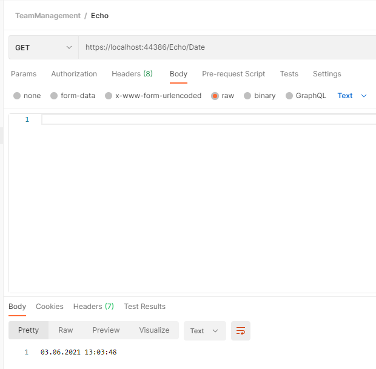

<!--Category:C#--> 
 <p align="right">
        <a href="https://www.nuget.org/packages/ProductivityTools.ConsoleColors/"></a>
        <a href="http://productivitytools.tech/consolecolors/"><a> 
        <a href="https://github.com/pwujczyk/ProductivityTools.ConsoleColors"></a>
</p>
<p align="center">
    <a href="http://productivitytools.tech/">
        
    </a>
</p>


# EchoApi

Nuget adds echo method to ASP.NET WebApi. 

<!--more-->

To use it you need to add application part to your controllers.

```c#
 services.AddControllers().AddApplicationPart(typeof(EchoController).Assembly);
 ```

 After it you can call your application to check if it is alive.

 

Library exposes two methods

- **GET** /Echo/Date - without any parameters should return current server date
- **Post** /Echo/Hello - 


## Calls

### GET
```
GET /Echo/Date HTTP/1.1
Host: localhost:44386
content: application/json
```

```powershell
$headers = New-Object "System.Collections.Generic.Dictionary[[String],[String]]"
$headers.Add("content", "application/json")
$response = Invoke-RestMethod 'https://localhost:44386/Echo/Date' -Method 'GET' -Headers $headers
$response | ConvertTo-Json
```


### Post

```
POST /Echo/Hello HTTP/1.1
Host: localhost:44386
content: application/json
Content-Type: application/json
Content-Length: 7

"pawel"
```

```PowerShell
$headers = New-Object "System.Collections.Generic.Dictionary[[String],[String]]"
$headers.Add("content", "application/json")
$headers.Add("Content-Type", "application/json")

$body = "`"pawel`""

$response = Invoke-RestMethod 'https://localhost:44386/Echo/Hello' -Method 'POST' -Headers $headers -Body $body
$response | ConvertTo-Json
```